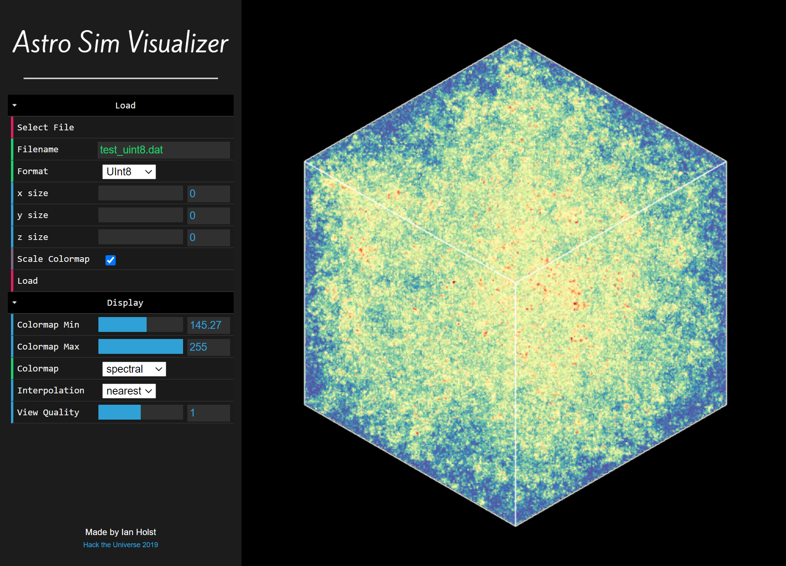

# Astro Simulation Visualizer

This is a simple web app that lets you easily load plain binary 3D data files (like from `ndarray.tofile()`) and display them with WebGL volume rendering. Colormaps and interpolation are customizable.

[**Run in browser**](https://raw.githack.com/ianholst/astro-sim-visualizer/master/index.html)

